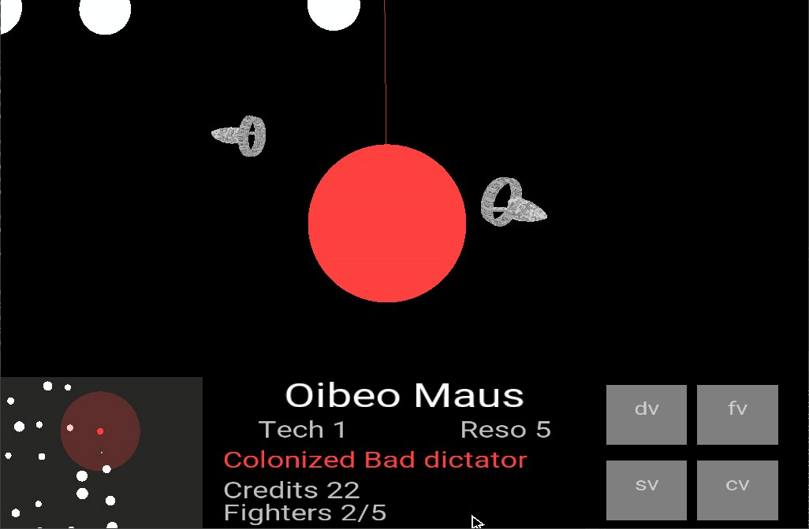

# Empires

This game is about colonizing the empire. It is more of a simulation game where you can see your empire grow over time. [**Click here to see the features of the game**](https://drive.google.com/open?id=1UP6wHF0erPQoFHxp3CygP1c4PjzUsd1M3I1RBvUso-w). The purpose of this project was to be introduced to working on different platforms than your computer (In our case, the Raspberry Pi). Thus, it is important that the code you write is optimized, you can't rely on the power of the computer. 

> All my research and experiences are in the docs folder. 

## How to run the project?
This project is only made for the Raspberry Pi (thus I have not included any binaries), the graphics rely on GLES, which files are already on the Pi. If you want to build it yourself, you will have to use VS2017. Be sure that you have the components installed which allows compilation on a remote system (I think it was the linux component). You can install this in the VS installer.

After that, you will have to add your RP as a remote target in the configuration. You will also have to install GLM and SOIL on the Pi. Just clone the files from their respective repos, as the project will build them while building itself.

Finally, keyboard input doesn't work with a VNC, you will have to connect a keyboard to the Pi yourself. 